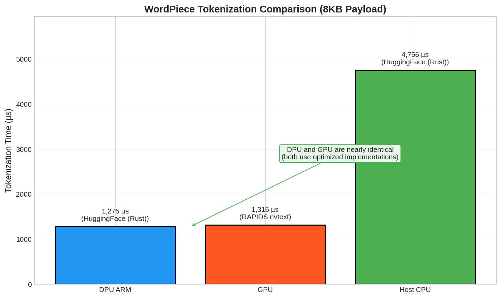

# BF3-Bench: DPU Tokenization Offload for LLM Inference

Benchmark for evaluating tokenization offloading strategies using NVIDIA BlueField-3 DPU with GPUDirect RDMA.

---

## Background

Large Language Model (LLM) inference pipelines require tokenization—converting raw text into token IDs—before model computation. This preprocessing stage traditionally runs on CPU or GPU.

This project explores offloading tokenization to the NVIDIA BlueField-3 DPU. By performing tokenization on the DPU's ARM cores before transferring data via RDMA, GPU resources can be reserved for inference workloads.

---

## System Architecture

| Component | Specification |
|:----------|:--------------|
| DPU | NVIDIA BlueField-3 (ARM Cortex-A78, 16 cores) |
| Host CPU | x86_64 (benchmark comparison) |
| GPU | NVIDIA A100X (ConnectX-integrated) |
| Network | PCIe Gen4 x16, GPUDirect RDMA |

```
┌────────────────────┐                    ┌─────────────────────────────────┐
│   BlueField-3 DPU  │   PCIe Gen4 x16    │         Host System             │
│    (ARM Cores)     │◄──────────────────►│  ┌─────────┐    ┌───────────┐  │
│   192.168.200.2    │  GPUDirect RDMA    │  │ Host CPU│    │ A100X GPU │  │
└────────────────────┘                    │  └─────────┘    └───────────┘  │
                                          │  192.168.200.1                  │
                                          └─────────────────────────────────┘
```

---

## Experimental Design

### Comparison Scenarios

| Scenario | Pipeline |
|:---------|:---------|
| **DPU-Based** | Tokenize on DPU ARM → RDMA (tokens) → GPU Embed |
| **CPU-Based** | Tokenize on Host CPU → Copy to GPU → GPU Embed |
| **GPU-Based** | RDMA (raw text) → Tokenize on GPU → GPU Embed |

### Tokenization Algorithms

Two algorithms were tested to evaluate different computational characteristics:

| Algorithm | Vocabulary | Nature | Compatible Models |
|:----------|:-----------|:-------|:------------------|
| **BPE** | 50,257 (GPT-2) | Sequential | GPT-2/3, LLaMA |
| **WordPiece** | 30,522 (BERT) | Parallelizable | BERT, DistilBERT |

### Test Configuration

- **Payload**: 8 KB text
- **Iterations**: 10 per configuration
- **Measurement**: `clock_gettime(CLOCK_MONOTONIC)` per stage

---

## Results

### Three-Way Tokenization Comparison (8KB Payload)


**Fair Comparison**: All platforms use the same Greedy Longest-Match algorithm for BPE.

| Algorithm | Host CPU | DPU ARM | GPU | Best Platform |
|:----------|:---------|:--------|:----|:--------------|
| **BPE (Greedy)** | 332 µs | 531 µs | 9,235 µs | **Host CPU (28× vs GPU)** |
| **WordPiece** | 4,756 µs | 1,275 µs | 1,316 µs | **DPU/GPU (~equal)** |

### BPE Speedup Analysis


For sequential BPE tokenization (same Greedy algorithm on all platforms):
- **Host CPU (x86) is 28× faster than GPU** - x86 excels at sequential work
- **DPU ARM is 17× faster than GPU** - ARM also much better than GPU for sequential
- **Host CPU is 1.6× faster than DPU** - x86 has better single-thread performance

### Pipeline Timeline (BPE)


| Stage | CPU-Based | DPU-Based | GPU-Based |
|:------|:----------|:----------|:----------|
| Tokenization | 332 µs | 531 µs | 9,235 µs |
| RDMA Transfer | 1,011 µs | 1,011 µs | 1,011 µs |
| GPU Embedding | 46 µs | 46 µs | 46 µs |
| **Total** | **1,389 µs** | **1,588 µs** | **10,292 µs** |

### End-to-End Latency Breakdown


### WordPiece Comparison



For parallelizable WordPiece tokenization (BERT models):
- DPU and GPU achieve similar performance (~1,300 µs)
- Host CPU is slower (4,756 µs) due to lack of GPU acceleration

---

## Implementation Details

### Tokenizers (Fair Comparison)

BPE uses the **same Greedy Longest-Match algorithm** on all platforms:

| Platform | Algorithm | Implementation | Time (8KB) |
|:---------|:----------|:---------------|:-----------|
| **Host CPU** | BPE | C Greedy (`host_cpu_greedy_tokenizer.c`) | 332 µs |
| **DPU ARM** | BPE | C Greedy (`bpe_tokenizer.c`) | 531 µs |
| **GPU** | BPE | CUDA Greedy (`tokenizer_kernel.cu`) | 9,235 µs |
| **DPU ARM** | WordPiece | HuggingFace Tokenizers (Rust) | 1,275 µs |
| **GPU** | WordPiece | RAPIDS nvtext | 1,316 µs |
| **Host CPU** | WordPiece | HuggingFace Tokenizers (Rust) | 4,756 µs |

### Host CPU Greedy Tokenizer

```c
// benchmarks/host_cpu_greedy_tokenizer.c
// Same algorithm as DPU: Greedy Longest-Match
int num_tokens = greedy_tokenize(text, text_len, tokens, max_len);
```

### DPU BPE Tokenizer

```c
// src/dpu_client/bpe_tokenizer.c
BPEContext ctx;
bpe_init(&ctx, "vocab.json", "merges.txt");  // 50,257 tokens
int num_tokens = bpe_encode(&ctx, text, text_len, output_ids, max_len);
```

### GPU Tokenizers

```python
# WordPiece: RAPIDS nvtext (GPU-accelerated)
from pylibcudf.nvtext.wordpiece_tokenize import wordpiece_tokenize
result = wordpiece_tokenize(input_col, vocab, max_sequence_length)
```

```cuda
// BPE: src/host_server/tokenizer_kernel.cu (sequential, single thread)
__global__ void bpe_tokenize_kernel(const char* input, int32_t* output, ...);
```

### Embedding Kernel

```cuda
// src/host_server/embedding_kernel.cu
output[i] = word_embed[token_id] + pos_embed[position];
```

---

## Key Findings

1. **Sequential BPE: CPU > DPU > GPU** (same Greedy algorithm)
   - Host CPU (x86): 332 µs - best single-thread performance
   - DPU ARM: 531 µs - 1.6× slower than x86
   - GPU: 9,235 µs - 28× slower than x86 (sequential is terrible on GPU)

2. **WordPiece: DPU ≈ GPU**: Both achieve ~1,300 µs
   - Parallelizable algorithm benefits from GPU (RAPIDS nvtext)
   - Choose based on system architecture preferences

3. **Key Insight**:
   - For **sequential algorithms** (BPE), use CPU or DPU, never GPU
   - x86 CPU has best single-thread performance due to higher clock, better branch prediction
   - DPU advantage is **offloading** (freeing CPU for other tasks) and **RDMA integration**

---

## Build & Run

See [docs/Build.md](docs/Build.md) for repository structure, build instructions, and benchmark execution.

### Quick CPU Benchmark

```bash
python scripts/cpu_tokenizer_benchmark.py --payload-kb 8 --iterations 10
```

---

## About

**National Tsing Hua University (NTHU)**
**Large-Scale System Architecture Laboratory (LSAlab)**

Advisor: Prof. Jerry (Chi-Yuan) Chou (周志遠) - jchou@cs.nthu.edu.tw

This code is provided for academic and research purposes.
