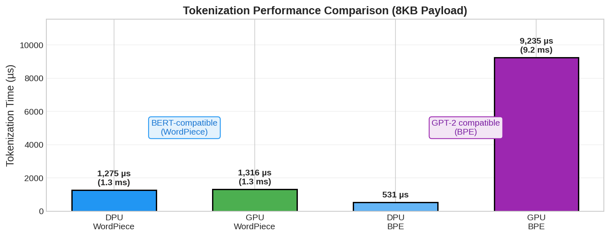
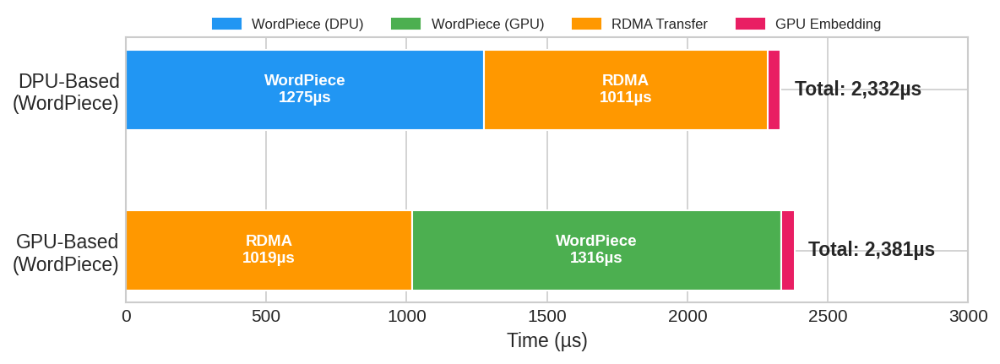
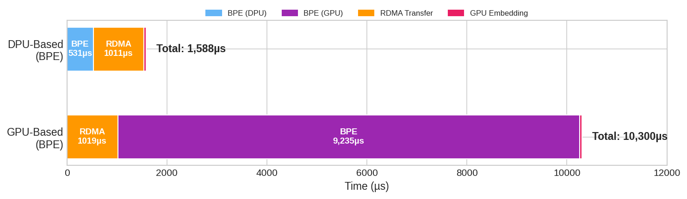
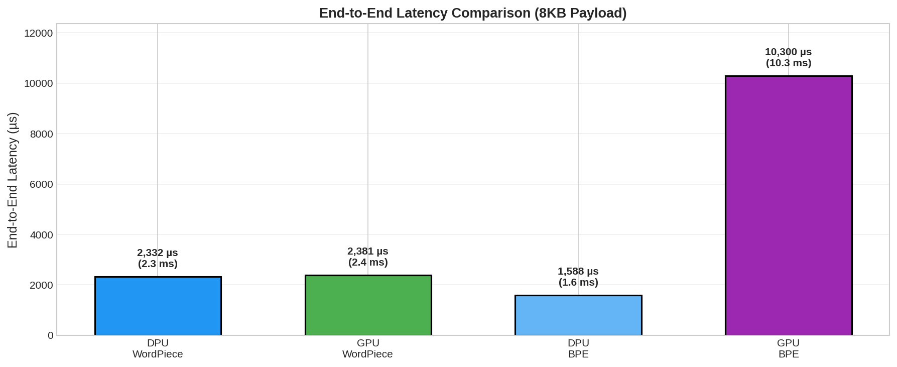

# BF3-Bench: DPU Tokenization Offload for LLM Inference

Benchmark for evaluating tokenization offloading strategies using NVIDIA BlueField-3 DPU with GPUDirect RDMA.

---

## Background

Large Language Model (LLM) inference pipelines require tokenization—converting raw text into token IDs—before model computation. This preprocessing stage traditionally runs on CPU or GPU.

This project explores offloading tokenization to the NVIDIA BlueField-3 DPU. By performing tokenization on the DPU's ARM cores before transferring data via RDMA, GPU resources can be reserved for inference workloads.

---

## System Architecture

| Component | Specification |
|:----------|:--------------|
| DPU | NVIDIA BlueField-3 (ARM Cortex-A78, 16 cores) |
| GPU | NVIDIA A100X (ConnectX-integrated) |
| Network | PCIe Gen4 x16, GPUDirect RDMA |

```
┌────────────────────┐                    ┌────────────────────┐
│   BlueField-3 DPU  │   PCIe Gen4 x16    │    Host System     │
│    (ARM Cores)     │◄──────────────────►│    (A100X GPU)     │
│   192.168.200.2    │  GPUDirect RDMA    │   192.168.200.1    │
└────────────────────┘                    └────────────────────┘
```

---

## Experimental Design

### Comparison Scenarios

| Scenario | Pipeline |
|:---------|:---------|
| **DPU-Based** | Tokenize on DPU → RDMA (tokens) → GPU Embed |
| **GPU-Based** | RDMA (raw text) → Tokenize on GPU → GPU Embed |

### Tokenization Algorithms

Two algorithms were tested to evaluate different computational characteristics:

| Algorithm | Vocabulary | Nature | Compatible Models |
|:----------|:-----------|:-------|:------------------|
| **WordPiece** | 30,522 (BERT) | Parallelizable | BERT, DistilBERT |
| **BPE** | 50,257 (GPT-2) | Sequential | GPT-2/3, LLaMA |

### Test Configuration

- **Payload**: 8 KB text
- **Iterations**: 10 per configuration
- **Measurement**: `clock_gettime(CLOCK_MONOTONIC)` per stage

---

## Results

### Tokenization Performance (8KB Payload)



| Method | DPU-Based | GPU-Based | Speedup |
|:-------|:----------|:----------|:--------|
| **WordPiece** | 1,275 µs | 1,316 µs | ~1× |
| **BPE** | 531 µs | 9,235 µs | **17×** |

### Pipeline Timeline

#### WordPiece



| Stage | DPU-Based | GPU-Based |
|:------|:----------|:----------|
| Tokenization | 1,275 µs | 1,316 µs |
| RDMA Transfer | 1,011 µs | 1,019 µs |
| GPU Compute | 46 µs | 46 µs |
| **Total** | **2,332 µs** | **2,381 µs** |

#### BPE



| Stage | DPU-Based | GPU-Based |
|:------|:----------|:----------|
| Tokenization | 531 µs | 9,235 µs |
| RDMA Transfer | 1,011 µs | 1,019 µs |
| GPU Compute | 46 µs | 46 µs |
| **Total** | **1,588 µs** | **10,300 µs** |

### End-to-End Response Time



---

## Implementation Details

### Tokenizers

| Platform | Algorithm | Implementation |
|:---------|:----------|:---------------|
| **DPU** | BPE | C sequential (`src/dpu_client/bpe_tokenizer.c`) |
| **DPU** | WordPiece | HuggingFace Tokenizers (Rust, `scripts/wordpiece_tokenizer.py`) |
| **GPU** | BPE | CUDA sequential (`src/host_server/tokenizer_kernel.cu`) |
| **GPU** | WordPiece | RAPIDS nvtext (`pylibcudf.nvtext.wordpiece_tokenize`) |

### DPU Tokenizers

```c
// BPE: src/dpu_client/bpe_tokenizer.c
BPEContext ctx;
bpe_init(&ctx, "vocab.json", "merges.txt");  // 50,257 tokens, 49,992 merges
int num_tokens = bpe_encode(&ctx, text, text_len, output_ids, max_len);
```

```python
# WordPiece: scripts/wordpiece_tokenizer.py (uses HuggingFace Tokenizers)
from tokenizers import Tokenizer
tokenizer = Tokenizer.from_file("bert-base-uncased.json")
output = tokenizer.encode(text)
token_ids = output.ids
```

### GPU Tokenizers

```python
# WordPiece: scripts/wordpiece_tokenizer.py (RAPIDS nvtext)
from pylibcudf.nvtext.wordpiece_tokenize import wordpiece_tokenize
result = wordpiece_tokenize(input_col, vocab, max_sequence_length)
```

```cuda
// BPE: src/host_server/tokenizer_kernel.cu (sequential, single thread)
__global__ void bpe_tokenize_kernel(const char* input, int32_t* output, ...);
```

### Embedding Kernel

```cuda
// src/host_server/embedding_kernel.cu
output[i] = word_embed[token_id] + pos_embed[position];
```

---

## Build & Run

See [docs/Build.md](docs/Build.md) for repository structure, build instructions, and benchmark execution.

---

## About

**National Tsing Hua University (NTHU)**  
**Large-Scale System Architecture Laboratory (LSAlab)**

Advisor: Prof. Jerry (Chi-Yuan) Chou (周志遠) - jchou@cs.nthu.edu.tw

This code is provided for academic and research purposes.
