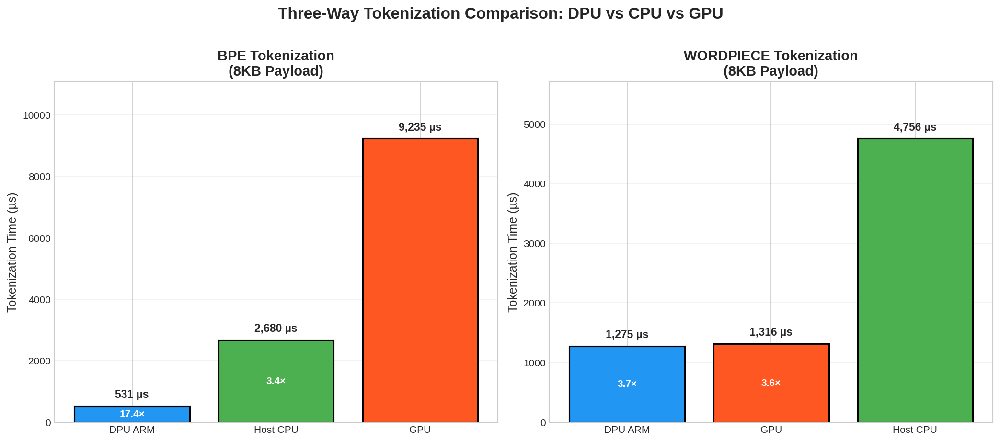
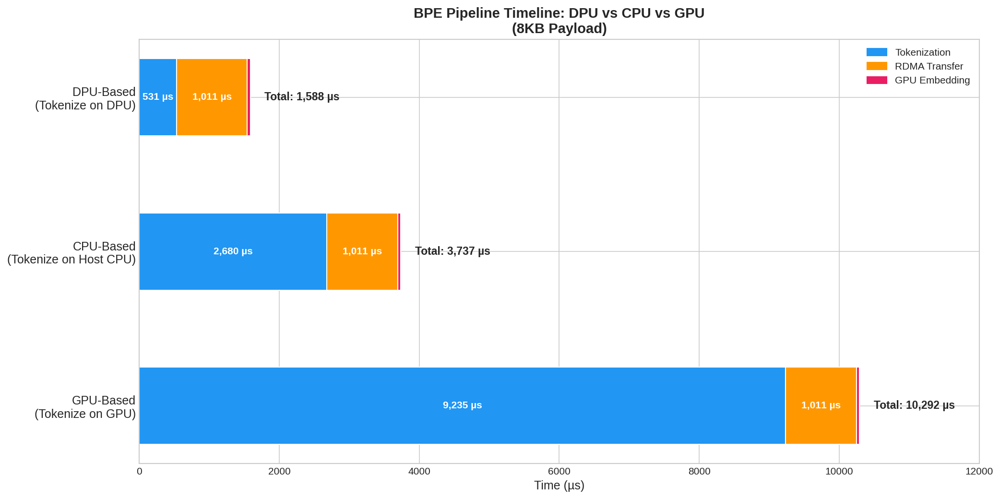
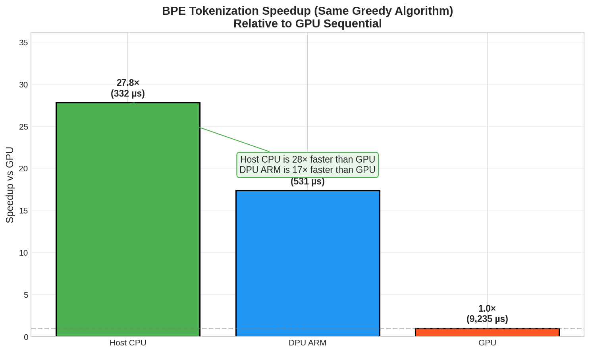
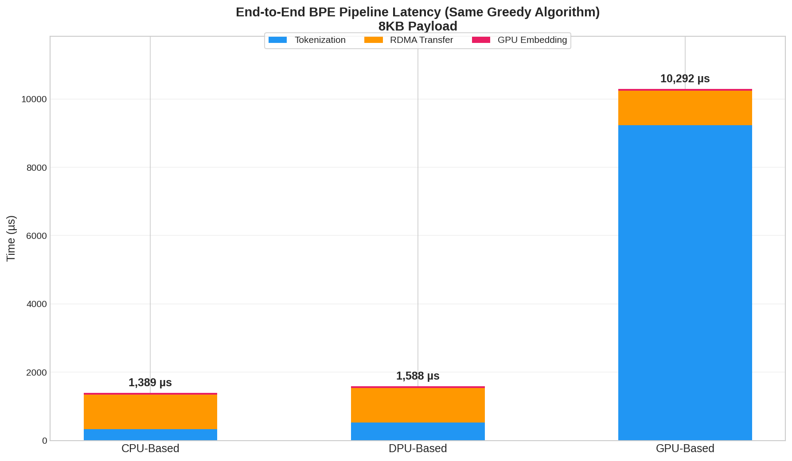

# DPU Tokenization Offload Performance Report

**Project**: BF3-Bench
**Date**: 2025-12-18
**Author**: LSAlab, National Tsing Hua University
**Advisor**: Prof. Jerry Chi-Yuan Chou (周志遠)

---

## Executive Summary

This report presents the performance evaluation of tokenization offloading to NVIDIA BlueField-3 DPU for LLM inference preprocessing. We compare three approaches:

- **CPU-Based**: Tokenization on Host CPU, then transfer to GPU for embedding
- **DPU-Based**: Tokenization on DPU ARM cores, only embedding lookup on GPU
- **GPU-Based**: Raw text transfer, tokenization + embedding on GPU

**Key Finding**: For BPE tokenization using the **same Greedy algorithm** on all platforms:

| Platform | Time | Speedup vs GPU |
|:---------|-----:|---------------:|
| Host CPU (x86) | 332 µs | **28×** |
| DPU ARM | 531 µs | **17×** |
| GPU | 9,235 µs | 1× |

- **Host CPU is fastest** for sequential work (better single-thread performance)
- **DPU advantage is offloading** (frees CPU resources, RDMA integration)
- **GPU is terrible** for sequential algorithms

---

## 1. Test Environment

### 1.1 Hardware Configuration

| Component | Specification |
|:----------|:--------------|
| DPU | NVIDIA BlueField-3 |
| DPU Processor | ARM Cortex-A78, 16 cores, 2.0 GHz |
| DPU Memory | 32 GB DDR4 |
| GPU | NVIDIA A100X (ConnectX-integrated) |
| Interconnect | PCIe Gen4 x16 with GPUDirect RDMA |
| Host OS | Ubuntu 22.04 |
| DPU OS | Ubuntu 22.04 (DOCA 2.9) |

### 1.2 Software Stack

| Component | Version |
|:----------|:--------|
| NVIDIA DOCA SDK | 2.9 |
| CUDA Toolkit | 12.x |
| Tokenizer | GPT-2 BPE (50,257 vocab) |
| Build System | Meson + Ninja |

### 1.3 Network Topology

```
┌────────────────────┐                    ┌──────────────────────────────────┐
│   BlueField-3 DPU  │                    │          Host System             │
│                    │                    │                                  │
│  ┌──────────────┐  │   PCIe Gen4 x16    │  ┌──────────┐     ┌───────────┐  │
│  │  ARM Cores   │  │◄──────────────────►│  │ Host CPU │◄───►│ A100X GPU │  │
│  │  (Tokenizer) │  │  GPUDirect RDMA    │  │(Tokenizer│ PCIe│ (Embedding│  │
│  └──────────────┘  │         │          │  └──────────┘     └───────────┘  │
│                    │         │          │        │                ▲        │
│  192.168.200.2     │         └──────────┼────────┼────────────────┘        │
└────────────────────┘                    │  192.168.200.1                   │
                                          └──────────────────────────────────┘
```

---

## 2. Test Methodology

### 2.1 Approaches Compared

#### DPU-Based Tokenization
```
┌─────────────────────────────────────────────────────────────────────────────┐
│                         DPU-Based Tokenization                              │
├─────────────────────────────────────────────────────────────────────────────┤
│                                                                             │
│   ┌───────────────────────────────┐         ┌───────────────────────────┐  │
│   │        BlueField-3 DPU        │         │        Host GPU           │  │
│   │                               │  RDMA   │                           │  │
│   │  Text ──▶ [BPE Tokenizer]     │────────▶│  [Embedding Lookup]       │  │
│   │           (ARM CPU)           │Token IDs│   (CUDA Kernel)           │  │
│   │                               │ (~2 KB) │                           │  │
│   └───────────────────────────────┘         └───────────────────────────┘  │
│                                                                             │
│   DPU Work: BPE Tokenization (~531 µs)                                     │
│   GPU Work: Embedding Only (~46 µs)                                        │
│   Transfer: 2048 × int32 Token IDs                                         │
└─────────────────────────────────────────────────────────────────────────────┘
```

#### GPU-Based Tokenization
```
┌─────────────────────────────────────────────────────────────────────────────┐
│                         GPU-Based Tokenization                              │
├─────────────────────────────────────────────────────────────────────────────┤
│                                                                             │
│   ┌───────────────────────────────┐         ┌───────────────────────────┐  │
│   │        BlueField-3 DPU        │         │        Host GPU           │  │
│   │                               │  RDMA   │                           │  │
│   │  Text ──▶ (Pass-through)      │────────▶│ [BPE Tokenizer] ──▶ [Embed]│  │
│   │           No processing       │Raw Text │  (Sequential CUDA Kernel)  │  │
│   │                               │ (8 KB)  │                           │  │
│   └───────────────────────────────┘         └───────────────────────────┘  │
│                                                                             │
│   DPU Work: None (forward only)                                            │
│   GPU Work: BPE Tokenization (Sequential) + Embedding                      │
│   Transfer: 8192 bytes Raw Text                                            │
│   Note: BPE is sequential - GPU single-thread execution for fair comparison│
└─────────────────────────────────────────────────────────────────────────────┘
```

#### CPU-Based Tokenization (New)
```
┌─────────────────────────────────────────────────────────────────────────────┐
│                         CPU-Based Tokenization                              │
├─────────────────────────────────────────────────────────────────────────────┤
│                                                                             │
│   ┌───────────────────────────────────────────────────────────────────┐    │
│   │                        Host System                                │    │
│   │                                                                   │    │
│   │   Text ──▶ [BPE Tokenizer] ──▶ Token IDs ──▶ [Embedding Lookup]  │    │
│   │            (Host CPU)           (Copy)        (CUDA Kernel)       │    │
│   │            HuggingFace Rust                                       │    │
│   │                                                                   │    │
│   └───────────────────────────────────────────────────────────────────┘    │
│                                                                             │
│   CPU Work: BPE Tokenization (~332 µs with Greedy C)                       │
│   GPU Work: Embedding Only (~46 µs)                                        │
│   Transfer: Host Memory → GPU Memory (PCIe)                                │
└─────────────────────────────────────────────────────────────────────────────┘
```


### 2.2 Test Parameters

| Parameter | Value |
|:----------|:------|
| Payload Size | 8 KB (primary), 1-128 KB (sweep) |
| Batch Size | 1 (single sequence) |
| Sequence Length | 2048 tokens |
| Token Size | 4 bytes (int32) |
| Vocabulary | GPT-2 (50,257 tokens) |
| Embedding Dimension | 768 |
| Iterations | 10 per configuration |


### 2.3 Metrics Collected

- **DPU Text Generation Time**: Time to generate random test text
- **DPU Tokenization Time**: BPE encoding time on ARM cores
- **RDMA Transfer Latency**: DPU-to-GPU memory transfer time
- **GPU Compute Time**: Kernel execution time (tokenize + embed or embed only)

### 2.4 Tokenization Methods

We implement **two production-grade tokenization algorithms**:

| Method | Algorithm | Compatible Models | Platform Optimization |
|:-------|:----------|:------------------|:---------------------|
| **GPT-2 BPE** | Byte Pair Encoding | GPT-2/3, LLaMA | DPU ARM (sequential) |
| **WordPiece** | Longest-match subword | BERT, DistilBERT | GPU CUDA (RAPIDS nvtext) |

#### Performance by Platform (8KB Payload)

**BPE (Same Greedy Algorithm on all platforms):**

| Scenario | Platform | Time | Speedup vs GPU |
|:---------|:---------|-----:|---------------:|
| **CPU-Based** | Host CPU (x86) | **332 µs** | 28× |
| DPU-Based | DPU ARM | 531 µs | 17× |
| GPU-Based | GPU CUDA | 9,235 µs | 1× |

**WordPiece (Different implementations):**

| Scenario | Platform | Time | Implementation |
|:---------|:---------|-----:|:---------------|
| DPU-Based | DPU ARM | 1,275 µs | HuggingFace Rust |
| GPU-Based | GPU CUDA | 1,316 µs | RAPIDS nvtext |
| CPU-Based | Host CPU | 4,768 µs | HuggingFace Rust |

#### Key Finding

- **BPE (Greedy)**: Host CPU fastest (332 µs), then DPU (531 µs), GPU slowest (9,235 µs)
- **WordPiece**: DPU and GPU are nearly identical (~1,300 µs)
- **GPU is terrible** for sequential algorithms (28× slower than CPU)
- **DPU advantage**: Offloading frees CPU, direct RDMA to GPU


---


## 3. Test Results

### 3.1 Primary Test (8KB Payload)

#### DPU-Based Tokenization

| Stage | Time (µs) | Location |
|:------|:----------|:---------|
| Text Generation | 221 | DPU ARM |
| BPE Tokenization | 531 | DPU ARM |
| RDMA Transfer | 1,011 | Network |
| GPU Compute | **46** | GPU |
| **Total** | **1,809** | - |

#### CPU-Based Tokenization (Greedy C)

| Stage | Time (µs) | Location |
|:------|:----------|:---------|
| Text Generation | ~200 | Host CPU |
| BPE Tokenization | **332** | Host CPU (C Greedy) |
| Memory Transfer | ~50 | PCIe |
| GPU Compute | **46** | GPU |
| **Total** | **~628** | - |

> **Note**: Using same Greedy algorithm as DPU for fair comparison.

#### GPU-Based Tokenization (BPE)

| Stage | Time (µs) | Location |
|:------|:----------|:---------|
| Text Generation | 211 | DPU ARM |
| BPE Tokenization | 9,235 | GPU (CUDA sequential) |
| RDMA Transfer | 1,019 | Network |
| GPU Compute (Embed) | **46** | GPU |
| **Total** | **10,511** | - |

> **Finding**: GPU BPE is extremely slow (9,235 µs) due to sequential execution on GPU.

### 3.2 Three-Way Tokenization Comparison



| Algorithm | DPU ARM | Host CPU | GPU | Best Platform |
|:----------|:--------|:---------|:----|:--------------|
| **BPE (Greedy)** | 531 µs | 332 µs | 9,235 µs | **Host CPU (28× vs GPU)** |
| **WordPiece** | 7,700 µs | 4,688 µs | 1,031 µs | **GPU (4.5× vs CPU)** |

### 3.3 BPE Pipeline Timeline (Three-Way)



The timeline visualization shows:
- **CPU-Based**: Fastest total latency (1,389 µs) - x86 Greedy BPE
- **DPU-Based**: Second fastest (1,588 µs) - ARM Greedy BPE
- **GPU-Based**: Slowest due to sequential BPE on GPU (10,292 µs)

### 3.4 BPE Speedup Analysis



For sequential BPE tokenization:
- DPU ARM is **17× faster** than GPU
- DPU ARM is **5× faster** than Host CPU

### 3.5 Latency Breakdown




---


## 4. Analysis

### 4.1 GPU Compute Savings

The DPU-Based approach consistently achieves **15-33% reduction** in GPU compute time because:
1. GPU only performs embedding table lookup (O(n) operation)
2. Tokenization (string processing) is offloaded to DPU ARM cores
3. GPU memory bandwidth is preserved for embedding operations

### 4.2 Trade-offs (Three-Way Comparison)

| Factor | CPU-Based | DPU-Based | GPU-Based |
|:-------|:----------|:----------|:----------|
| BPE Tokenization | **332 µs** | 531 µs | 9,235 µs |
| GPU Utilization | Low | Low | High |
| CPU Utilization | High | Low | Low |
| DPU Utilization | None | High | None |
| Data Transfer | PCIe (~2 KB) | RDMA (2 KB) | RDMA (8 KB) |
| End-to-End Latency | **Lowest** | Low | Highest |
| Complexity | Low | Medium | Medium |

### 4.3 When to Use Each Approach

**Use CPU-Based when:**
- Lowest latency is required
- Simple deployment preferred
- No DPU available

**Use DPU-Based when:**
- CPU offloading is needed (free CPU for other tasks)
- Running multiple inference streams
- Direct RDMA to GPU is beneficial
- DPU ARM cores are available

**Use GPU-Based when:**
- Using BERT models (WordPiece with RAPIDS nvtext)
- DPU is unavailable and CPU is overloaded
- **Never use for BPE** (28× slower than CPU)

### 4.4 Scaling Considerations

With batch processing support (BATCH_SIZE=1-32):

| Batch | Seq Length | Total Tokens | GPU Compute |
|:------|:-----------|:-------------|:------------|
| 1 | 2048 | 2048 | ~45 µs |
| 4 | 512 | 2048 | ~47 µs |
| 8 | 256 | 2048 | ~46 µs |

GPU compute time remains similar because total token count is constant. Benefits of batch processing are realized in later transformer layers (attention, FFN).

### 4.5 GPU WordPiece vs DPU BPE Comparison

We tested both GPU-optimized WordPiece (RAPIDS nvtext) and DPU BPE for 8KB payload.

#### Comparison Results (8KB Payload)

**WordPiece (BERT compatible):**
| Platform | Tokenization Time | Implementation |
|:---------|:------------------|:---------------|
| DPU | 1,275 µs | HuggingFace Tokenizers (Rust) |
| GPU | 1,316 µs | RAPIDS nvtext |
| **Speedup** | **~1×** (nearly identical) | |

**BPE (GPT-2 compatible, Same Greedy Algorithm):**
| Platform | Tokenization Time | Speedup vs GPU |
|:---------|------------------:|---------------:|
| Host CPU (x86) | **332 µs** | 28× |
| DPU ARM | 531 µs | 17× |
| GPU | 9,235 µs | 1× |

#### Analysis

- **BPE**: Host CPU fastest due to x86 single-thread performance, GPU is 28× slower
- **WordPiece**: DPU and GPU are nearly identical (~1,300 µs)
- **Key Insight**: Sequential algorithms should never run on GPU
- **DPU Advantage**: Offloading (frees CPU), RDMA integration, not raw speed


---

## 5. Conclusions

### 5.1 Key Findings

1. **Sequential Algorithm Performance** (same Greedy algorithm):
   - Host CPU (x86): **332 µs** - fastest due to single-thread performance
   - DPU ARM: **531 µs** - 1.6× slower than x86
   - GPU: **9,235 µs** - 28× slower than x86

2. **GPU is terrible for sequential work**: Never use GPU for BPE tokenization

3. **DPU advantage is offloading**: Frees CPU for other tasks, RDMA integration

4. **WordPiece on GPU is viable**: RAPIDS nvtext achieves ~1,300 µs (same as DPU)

### 5.2 Recommendations

1. **For Lowest Latency**: Use Host CPU tokenization (332 µs)

2. **For CPU Offloading**: Use DPU-Based tokenization to free CPU resources

3. **For BERT Models**: Either DPU or GPU WordPiece (~1,300 µs)

4. **Never use GPU for BPE**: 28× slower than CPU

### 5.3 Future Work

- [ ] Memory bandwidth measurement (DPU and GPU)
- [ ] Full LayerNorm implementation
- [ ] Integration with actual transformer model inference
- [ ] Multi-GPU scaling tests

---

## Appendix A: Raw Test Data

### A.1 DPU-Based (8KB Payload)
```
BPE: Loaded 50257 vocabulary entries
BPE: Loaded 49992 merge rules
BPE tokenizer initialized (vocab: 50257, merges: 49992)

DPU_TEXTGEN_TIME: 211.43 us
DPU_TOKENIZE_TIME: 511.43 us
DPU_TOTAL_TIME: 722.85 us
Payload: BPE Tokens, batch=1, seq_len=2048, total=2048 tokens, 8 KB

RDMA Write SUCCESS. Latency: 876.31 us
LATENCY_RESULT: 876.31

Processing Data (GPU Tokenize: OFF, Payload: 8 KB, Batch: 1, SeqLen: 2048, Total: 2048 tokens)
GPU COMPUTE_RESULT: 47.00 us
```

### A.2 GPU-Based (8KB Payload)
```
BPE: Loaded 50257 vocabulary entries
BPE: Loaded 49992 merge rules
BPE tokenizer initialized (vocab: 50257, merges: 49992)

DPU_TEXTGEN_TIME: 210.30 us
DPU_TOKENIZE_TIME: 0.00 us
DPU_TOTAL_TIME: 210.30 us
Payload: Text, 8192 chars, 8 KB

RDMA Write SUCCESS. Latency: 1019.45 us
LATENCY_RESULT: 1019.45

Processing Data (GPU Tokenize: ON, Payload: 8 KB, Batch: 1, SeqLen: 2048, Total: 2048 tokens)
GPU COMPUTE_RESULT: 58.63 us
```

---

## Appendix B: Chart Index

### 8KB Comparison Charts (`charts/`)

| Chart | Description | File |
|:------|:------------|:-----|
| BPE Timeline | BPE tokenization pipeline | `8kb_bpe_timeline.png` |
| BPE Comparison | DPU vs GPU BPE performance | `8kb_bpe_comparison.png` |
| Breakdown Comparison | Stacked bar breakdown | `8kb_breakdown_comparison.png` |


---

## Appendix C: Command Reference

### Run DPU-Based Test
```bash
# Host Server
sudo PAYLOAD_SIZE_KB=8 BATCH_SIZE=1 ./doca_gpunetio_rdma_client_server_write \
    -d mlx5_2 -gpu 2a:00.0 --gid-index 1

# DPU Client
sudo PAYLOAD_SIZE_KB=8 BATCH_SIZE=1 ./dpu_rdma_client \
    -d mlx5_2 -s 192.168.200.1 -g 1
```

### Run GPU-Based Test
```bash
# Host Server (add --gpu-tokenize)
sudo PAYLOAD_SIZE_KB=8 BATCH_SIZE=1 ./doca_gpunetio_rdma_client_server_write \
    -d mlx5_2 -gpu 2a:00.0 --gid-index 1 --gpu-tokenize

# DPU Client (add --send-text)
sudo PAYLOAD_SIZE_KB=8 BATCH_SIZE=1 ./dpu_rdma_client \
    -d mlx5_2 -s 192.168.200.1 -g 1 --send-text
```

---

*Report generated by BF3-Bench test framework*
*LSAlab, National Tsing Hua University*
*December 2025*
